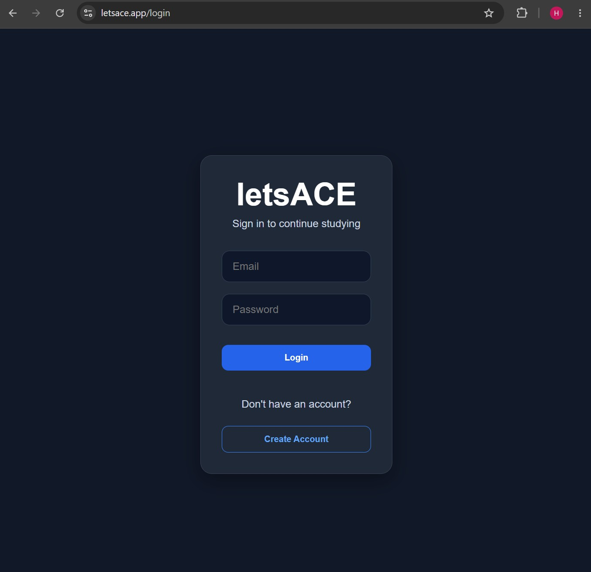
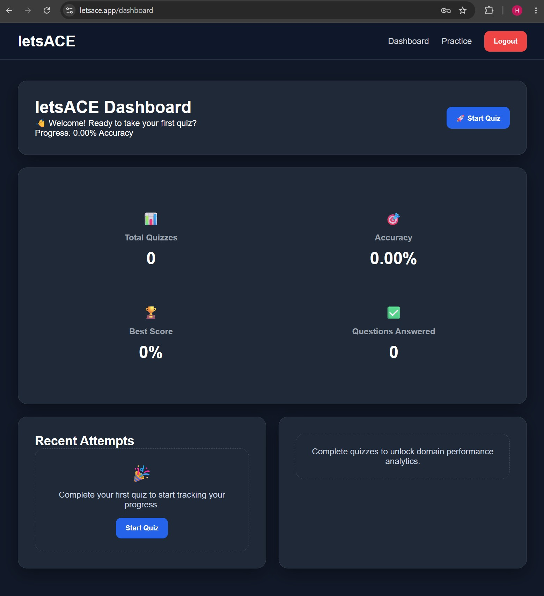
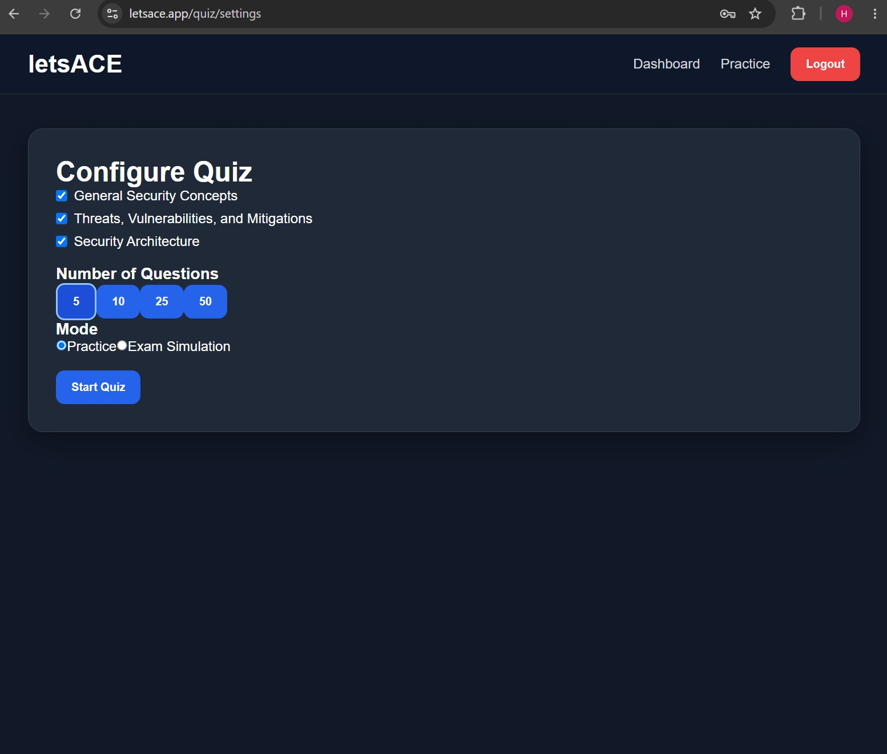
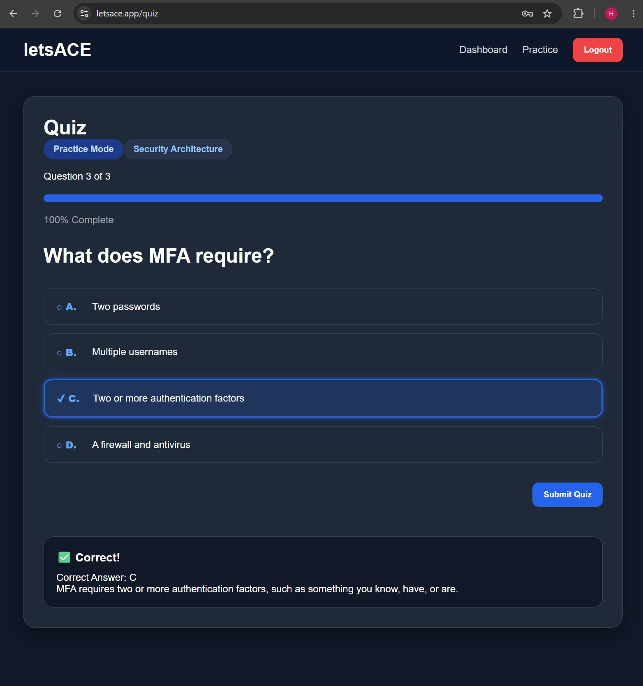
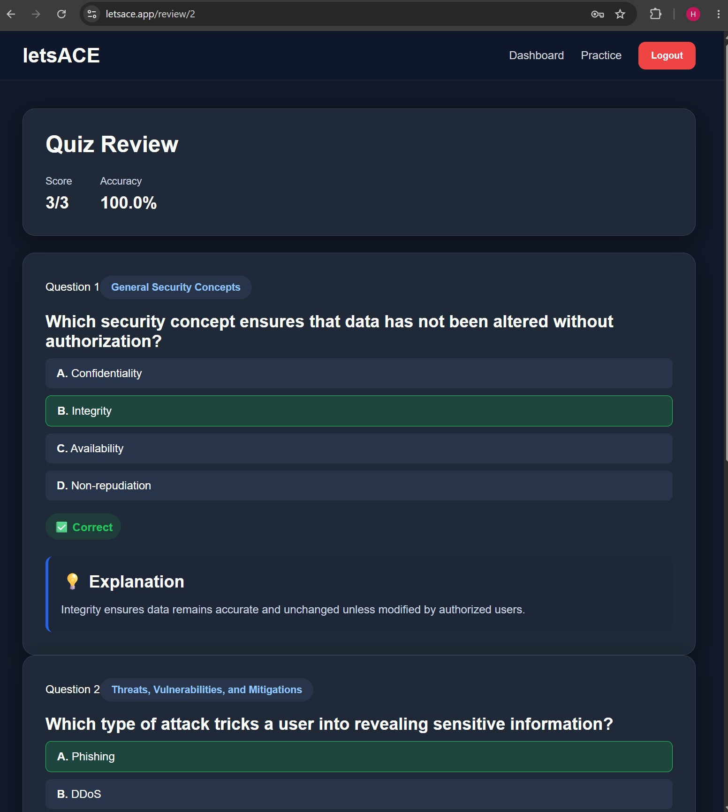
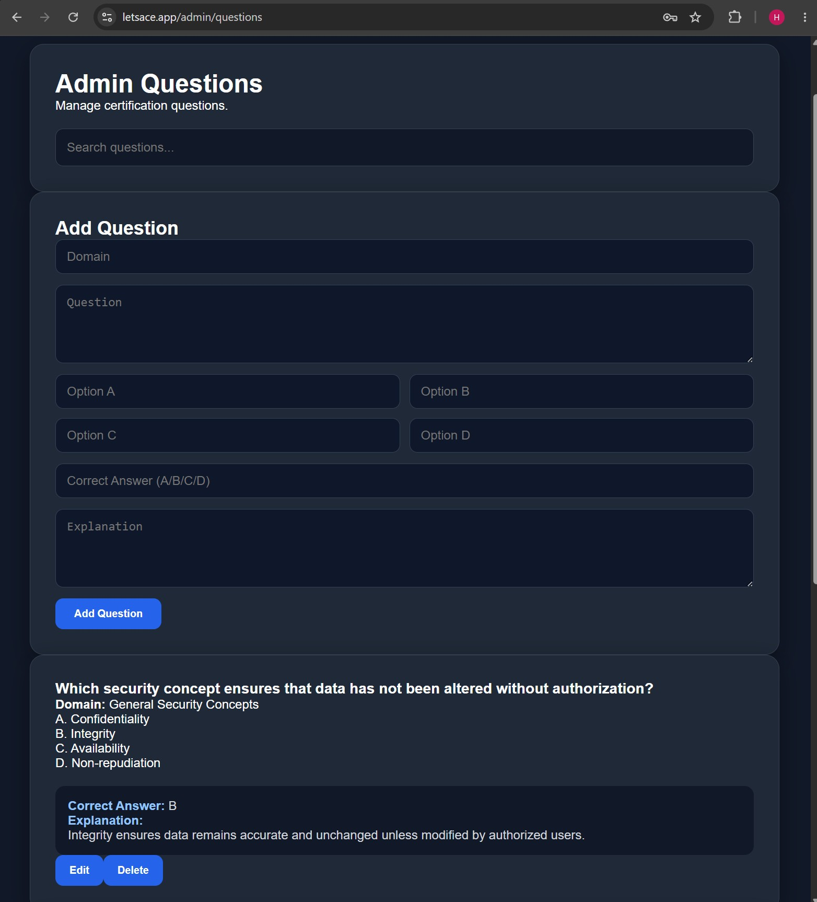

# letsACEREADME.md

# letsACE

Certification practice platform built with React, FastAPI, and PostgreSQL.

## Features
- Secure user authentication with JWT
- Custom quiz engine
- Performance dashboard
- Question review system
- Admin question management
- Responsive UI

## Tech Stack

Frontend:
React
Vite
Axios
React Router

Backend:
FastAPI
SQLAlchemy
PostgreSQL
Alembic
JWT Authentication

Deployment:
Vercel
Render

## Architecture

React Client
      |
      |
 FastAPI REST API
      |
      |
 PostgreSQL Database


## Screenshots

### Login


### User Dashboard


### Quiz Settings


### Quiz


### Quiz Review


### Admin Panel



## Live Demo

Live App: https://letsace.app

Demo User:

```text
Email: demo@letsace.com
Password: password123


## Running Locally

Backend:
pip install -r requirements.txt

Frontend:
npm install
npm run dev
